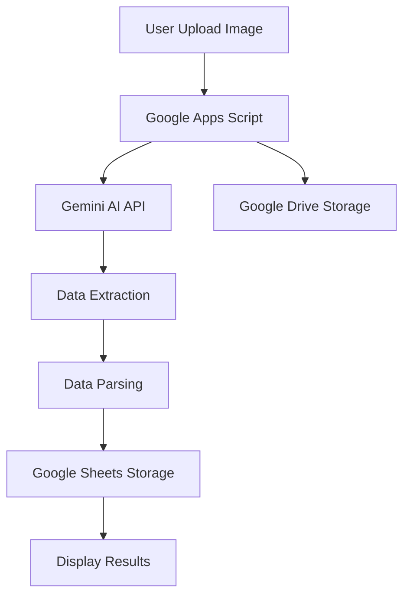

# 🎓 Student Attendance Parser AI

[](https://script.google.com/)
[](https://ai.google.dev/)
[](https://opensource.org/licenses/MIT)

> 🤖 AI-powered student attendance sheet parser that automatically extracts student data and attendance records from scanned documents using Google Apps Script and Gemini AI.

## ✨ Features

- 🔍 **Smart Document Recognition** - Automatically identifies attendance sheets vs other documents
- 👥 **Student Data Extraction** - Extracts student names, ID numbers, and personal information
- 📊 **Attendance Tracking** - Processes attendance marks (Present/Absent/Sick/Permission)
- 🏫 **Institution Information** - Captures school/madrasah details, class, and academic year
- 📈 **Attendance Analytics** - Calculates attendance percentages and generates summaries
- 💾 **Google Sheets Integration** - Automatically saves extracted data to spreadsheets
- 🖼️ **Multiple Format Support** - Works with JPG, PNG, and GIF images
- 📱 **Responsive Design** - Modern, mobile-friendly interface
- 🇮🇩 **Indonesian Education System** - Optimized for Indonesian schools and madrasahs

## 🚀 Quick Start

### Prerequisites

- Google Account
- Google Apps Script access
- Gemini AI API key ([Get one here](https://ai.google.dev/))
- Google Drive folder for image storage
- Google Sheets for data storage

### Installation

1. **Clone this repository**
   ```bash
   git clone https://github.com/classyid/daftar-hadir-extractor-gemini.git
   ```

2. **Create a new Google Apps Script project**
   - Go to [script.google.com](https://script.google.com)
   - Click "New Project"

3. **Upload the files**
   - Replace `Code.gs` with the content from `Code.gs`
   - Create `Index.html` and paste the HTML content
   - Create `JavaScript.html` and `Stylesheet.html` with respective contents

4. **Configure the settings**
   ```javascript
   // Update these constants in Code.gs
   const GEMINI_API_KEY = 'your-gemini-api-key';
   const SPREADSHEET_ID = 'your-google-sheets-id';
   const FOLDER_ID = 'your-google-drive-folder-id';
   ```

5. **Deploy as web app**
   - Click "Deploy" > "New deployment"
   - Choose "Web app" as type
   - Set execute permissions
   - Copy the web app URL

## 📖 Usage

### Basic Usage

1. **Access the web app** using the deployed URL
2. **Upload an attendance sheet** by dragging & dropping or clicking to select
3. **Preview the image** to ensure it's clear and readable
4. **Click "Extract Data"** to process the attendance sheet
5. **Review the results** and copy or save the extracted data

### Supported Document Types

✅ **Supported:**
- Student attendance sheets (Daftar Hadir Siswa)
- Class attendance records
- School attendance forms
- Madrasah attendance documents

❌ **Not Supported:**
- Diplomas/Certificates (Ijazah)
- Report cards
- Administrative documents
- Personal documents

### Example Input


### Example Output
```
NAMA INSTITUSI: SDIT Ar-Rahmah Makassar
KELAS/SEMESTER: A / 1.1 / 2.2.a
TAHUN AJARAN: 2025-2026
MATA PELAJARAN: Al Qur'an
PERIODE/TANGGAL: Tahun Ajaran 2025-2026
KOORDINATOR/GURU: Koordinator Al Qur'an

DAFTAR SISWA DAN KEHADIRAN:
1. Zivana Lutfiah Zuhdi - Hadir 7 dari 9 hari
2. Khalifah Balqiih Kharis - Hadir 6 dari 9 hari
3. Reno Landya Almira I - Hadir 8 dari 9 hari
...

RINGKASAN KEHADIRAN:
- Total siswa: 13 siswa
- Persentase kehadiran rata-rata: 85%
- Catatan khusus: Data kehadiran untuk periode tertentu
```

## 🏗️ Architecture



## 📁 Project Structure

```
student-attendance-parser-ai/
├── Code.gs                 # Main server-side logic
├── Index.html             # Main web interface
├── JavaScript.html        # Client-side JavaScript
├── Stylesheet.html        # CSS styling
├── README.md             # This file
├── LICENSE               # MIT License
└── DEPLOYMENT.md         # Detailed installation guide

```

## ⚙️ Configuration

### Environment Variables

| Variable | Description | Required |
|----------|-------------|----------|
| `GEMINI_API_KEY` | Your Gemini AI API key | ✅ Yes |
| `SPREADSHEET_ID` | Google Sheets ID for data storage | ✅ Yes |
| `FOLDER_ID` | Google Drive folder ID for images | ✅ Yes |
| `LOG_SHEET_NAME` | Sheet name for logs (default: 'log') | ❌ No |
| `METADATA_SHEET_NAME` | Sheet name for metadata (default: 'metadata') | ❌ No |

### Gemini AI Settings

```javascript
const GEMINI_MODEL = 'gemini-2.0-flash';  // AI model version
```

## 🔧 Customization

### Adding New Data Fields

1. Update the `PROMPT_TEMPLATE` in `Code.gs`
2. Modify the `parseDaftarHadirData()` function
3. Update the Google Sheets headers
4. Adjust the UI display format

### Styling Customization

The interface uses modern CSS with custom properties for easy theming:

```css
:root {
  --primary-color: #4f46e5;
  --primary-hover: #4338ca;
  --success-color: #10b981;
  --error-color: #ef4444;
}
```

## 🤝 Contributing

Contributions are welcome! Please feel free to submit a Pull Request.

### Development Setup

1. Fork the repository
2. Create a feature branch: `git checkout -b feature/amazing-feature`
3. Make your changes
4. Test thoroughly
5. Commit: `git commit -m 'Add amazing feature'`
6. Push: `git push origin feature/amazing-feature`
7. Open a Pull Request

### Guidelines

- Follow JavaScript ES6+ standards
- Write clear commit messages
- Add tests for new features
- Update documentation as needed
- Maintain backward compatibility

## 📝 API Reference

### Main Functions

#### `processImage(fileData, fileName, mimeType)`
Processes uploaded image and extracts attendance data.

**Parameters:**
- `fileData` (string): Base64 encoded image data
- `fileName` (string): Original filename
- `mimeType` (string): Image MIME type

**Returns:**
```javascript
{
  success: boolean,
  description: string,
  fileUrl: string,
  dataSaved: boolean
}
```

#### `parseDaftarHadirData(description)`
Parses AI response into structured data.

**Parameters:**
- `description` (string): Raw AI response text

**Returns:** Object with parsed attendance data

## 🚨 Troubleshooting

### Common Issues

**Issue:** "API key not working"
- **Solution:** Verify your Gemini AI API key is correct and has proper permissions

**Issue:** "Cannot access Google Sheets"
- **Solution:** Check spreadsheet ID and sharing permissions

**Issue:** "Image not processing"
- **Solution:** Ensure image is clear, well-lit, and under 10MB

**Issue:** "No data extracted"
- **Solution:** Verify the document is a valid attendance sheet format

### Error Codes

| Code | Description | Solution |
|------|-------------|----------|
| `API_ERROR` | Gemini AI API failure | Check API key and quota |
| `SHEET_ERROR` | Google Sheets access denied | Verify spreadsheet permissions |
| `PARSE_ERROR` | Document format not recognized | Use supported attendance sheet format |

## 📊 Performance

- **Processing Time:** ~3-5 seconds per image
- **Accuracy Rate:** ~95% for clear, well-formatted documents
- **File Size Limit:** 10MB per image
- **Supported Formats:** JPG, PNG, GIF
- **Concurrent Users:** Limited by Google Apps Script quotas

## 🔒 Privacy & Security

- Images are temporarily stored in Google Drive
- All data processing happens within Google's infrastructure
- No data is shared with third parties
- Extracted data is only accessible to authorized users
- Original images can be deleted after processing

## 📄 License

This project is licensed under the MIT License - see the [LICENSE](LICENSE) file for details.

## 🙏 Acknowledgments

- [Google Apps Script](https://script.google.com/) for the hosting platform
- [Gemini AI](https://ai.google.dev/) for the powerful AI capabilities
- [Font Awesome](https://fontawesome.com/) for the beautiful icons
- Indonesian education community for feedback and testing

## 📞 Support

- 📧 **Email:** kontak@classy.id

---

<div align="center">

**⭐ Star this repo if it helped you! ⭐**

Made with ❤️ for Indonesian educators

[⬆ Back to Top](#-student-attendance-parser-ai)

</div>
